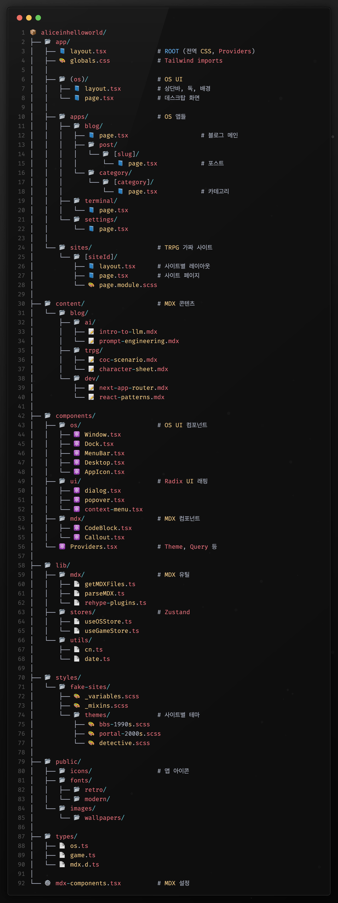

# Alice in HelloWorld

OS 인터페이스를 차용한 개인 블로그 겸 TRPG 툴킷.

## 개요

macOS/Windows 스타일의 데스크탑 환경에서 여러 앱을 실행하는 형태로 구현.  
블로그, 터미널, 설정 등의 앱과 TRPG용 가짜 웹사이트를 포함.

## 주요 기능

### 블로그
- **AI**: LLM, 프롬프트 엔지니어링, 이미지 생성 관련
- **TRPG**: 시나리오, 캐릭터 시트, 룰북 정리
- **Dev**: 프론트엔드 개발, 프레임워크, 코드 패턴

각 블로그는 독립된 앱으로 실행되며 OS UI 내에서 창 형태로 표시됨.

### TRPG 가짜 사이트
시대별/테마별 웹사이트를 재현한 인터랙티브 사이트.  
90년대 BBS, 2000년대 포털, 탐정사무소 등을 구현 예정.

플레이어가 사이트 간 데이터를 공유하며 퍼즐을 풀거나 단서를 수집하는 용도.

### OS UI
- 상단 메뉴바
===
- 드래그 가능한 창
- 최소화/최대화/닫기
- 다크모드 지원

## 기술 스택

- **Framework**: Next.js 16 (App Router)
- **Language**: TypeScript
- **Styling**: Tailwind CSS 4 + SCSS
- **UI Components**: Radix UI
- **State**: Zustand
- **Animation**: Framer Motion
- **Content**: MDX
- **Data Fetching**: TanStack Query

## 폴더 구조



## 설치 및 실행

```bash
# 의존성 설치
pnpm install

# 개발 서버
pnpm dev

# 빌드
pnpm build

# 프로덕션 실행
pnpm start
```

## 라우팅

```
/                           # OS 데스크탑
/apps/blog                  # 블로그 메인
/apps/blog/post/[slug]      # 포스트
/apps/blog/category/[cat]   # 카테고리
/sites/[siteId]             # TRPG 사이트
```

## 라이선스

- **Code**: MIT (`LICENSE`)
- **Content** (`content/**`): CC BY-NC-SA 4.0 (`CONTENT-LICENSE`)
- Third-party assets (fonts/icons/sounds) follow their own licenses.


## 연락

이슈 또는 PR 환영.